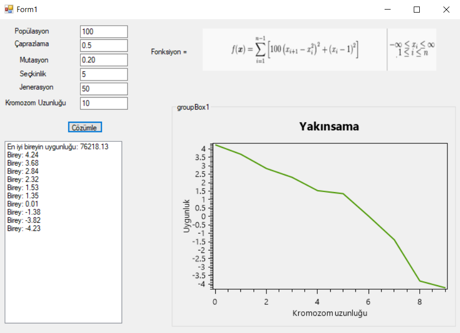

# Genetic Algorithm Application

Description
This project implements a Genetic Algorithm (GA) for solving optimization problems. It features a user-friendly graphical interface where users can configure algorithm parameters such as population size, crossover rate, and mutation rate, and view the results in real time through a convergence graph and detailed outputs. The application leverages OxyPlot for visualizing fitness progress and provides insights into the optimization process.


---

## Features

- **Parameter Input**: Users can configure the population size, crossover rate, mutation rate, elitism percentage, generation count, and chromosome length.
- **Graphical Solution Tracking**: A convergence graph visualizes fitness values across generations.
- **Result Visualization**:
  - Displays the fitness value of the best individual.
  - Lists the gene values of the best individual.
- **Mathematical Model**: The fitness function is displayed to help users understand the optimization goal.
- **Dynamic UI**: Users can interactively adjust parameters and follow the solution process.

---

## Screenshot

Below is a screenshot of the application:



- **Parameter Input Fields**: Configure algorithm parameters.
- **Solve Button**: Starts the genetic algorithm and displays results.
- **Result List**: Shows the fitness value and genes of the best individual.
- **Convergence Graph**: Displays the fitness of the best individual over generations.
- **Fitness Function**: The mathematical fitness function is displayed at the top.

---

## How to Use

1. **Input Parameters**:
   - **Population**: Set the population size (e.g., 100).
   - **Crossover**: Set the crossover rate (e.g., 0.5).
   - **Mutation**: Set the mutation rate (e.g., 0.2).
   - **Elitism**: Specify the percentage of elitism (e.g., 5%).
   - **Generations**: Set the number of generations (e.g., 50).
   - **Chromosome Length**: Define the length of chromosomes (e.g., 10).

2. **Run the Algorithm**:
   - Click the **Solve** button to start the algorithm.

3. **Analyze Results**:
   - View the fitness and genes of the best individual in the result list.
   - Analyze the convergence graph to see how the solution evolves over generations.

---

## Fitness Function

The fitness function used in this project is defined as follows:

\[
f(x) = \sum_{i=1}^{n-1} \left[ 100 \cdot (x_{i+1} - x_i^2)^2 + (x_i - 1)^2 \right], \quad -\infty \leq x_i \leq \infty
\]

This function is used to evaluate the fitness of each individual in the population. The goal is to minimize this function.

---

## Installation and Usage

1. **Requirements**:
   - .NET Framework 4.7 or higher.
   - Visual Studio IDE (for WinForms development).

2. **Steps**:
   - Clone or download the source code:
     ```bash
     git clone https://github.com/haydarkadioglu/genetic-algorithm.git
     ```
   - Open the project in Visual Studio.
   - Restore the required NuGet packages (e.g., `OxyPlot.WindowsForms`).
   - Build and run the project.

---

## Project Structure

- **Form1.cs**: Manages the user interface and interaction with the genetic algorithm.
- **GeneticAlgorithm.cs**: Contains the logic for the genetic algorithm.
- **OxyPlot**: A library used for generating the convergence graph.

---

## Example Results

Here is an example run with the following parameters:

- **Parameters**:
  - Population: 100
  - Crossover: 0.5
  - Mutation: 0.2
  - Generations: 50
  - Chromosome Length: 10
- **Results**:
  - Best individual fitness: `76218.13`
  - Gene values:
    ```
    [4.24, 3.68, 2.84, 2.32, 1.53, 1.35, 0.01, -1.38, -3.82, -4.23]
    ```

---

## Improvements and Suggestions

- **Selection Methods**: Add advanced selection methods such as tournament selection or roulette wheel selection.
- **Graph Enhancements**: Plot average fitness values alongside the best fitness.
- **Dynamic Updates**: Update the convergence graph dynamically as the algorithm runs.

---

## License

This project is licensed under the MIT License. For more details, see the `LICENSE` file.
